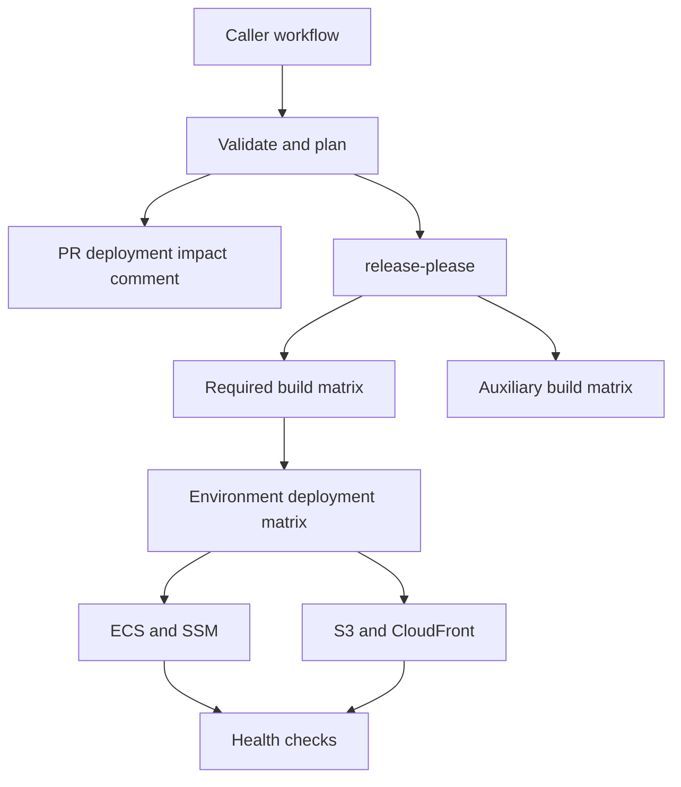

# CanadaLogin release system

This repository centralizes the release system used by CanadaLogin applications. A caller owns two small files:

1. `.github/workflows/release-pipeline.yml`, which calls the versioned reusable workflow.
2. `.github/release-pipeline-configuration.yml`, which declares builds, deployment infrastructure, notifications, and optional hooks.


## What it provides

- `release-please` integration to manage releases and changelogs
- `.deployed_versions/<environment>.json` files track deployed versions in source control
- ECS Fargate + ECR deployments with stability waits
- ECR immutable image management
- S3 build artifacts, S3 deployments, and CloudFront invalidations
- SBOM integration
- Slack start, success, build failure, and deployment failure notifications
- Repo-defined before-deploy, health-check, after-deploy, and failure hooks
- Health checks
- Multi-environment support

## Deployment behaviour

- The `dev` environment always tracks `main` and is deployd on every merge to main.
- All other environments track pinned versions in the `.deployed_versions/` directory. These environments are deployed by updating these files and merging to main.
- By default, `test` is auto-incremented when a release is made using release-please. Thus `test` always tracks the latest release.
- Other higher environments are manually incremented as needed. Do so using the usual PR process.
- GitHub CODEOWNERS or branch rulesets can be used to assign required approvers to deploy to specific environments.
- Deployments are orchestrated in GitHub Actions and can be viewed from the GitHub Actions tab.

## Quick start

### 1. Setup release-please configuration

See the [release-please repository](https://github.com/googleapis/release-please) for full details. At a minimum, you'll need an appropriate `release-please-config.json` file, and a `.release-please-manifest.json` file. Do not worry about invoking `release-please` from GitHub Actions, the release pipeline handles this.

You will also need to request the release-please GitHub app credentials are added to the repository secrets. Request this from CDS SRE in #sre-security-and-tooling.

### 2. Setup .deployed_versions/ files

The release pipeline uses files in `.deployed_versions/` to track the DESIRED application version for each environment. Create the directory and necessary files, see [this repository](https://github.com/cds-snc/canadalogin-user-selfservice-webapp/tree/main/.deployed_versions) as an example. A file is not needed for `dev` as it always tracks `main`.

### 3. Invoke the release pipeline from GitHub Actions

Copy [the caller workflow](examples/caller/release-pipeline.yml) to `.github/workflows/release-pipeline.yml`. Copy the closest application configuration from [examples](examples) to `.github/release-pipeline-configuration.yml`, then update its resource references and commands.

The caller examples pin a semver release. Optionally replace the release tag with a commit SHA for maximum immutability guarantees.

```yaml
jobs:
  release:
    uses: cds-snc/canadalogin-release-system/.github/workflows/release.yml@v1.0.6
    secrets: inherit
```

Read the [configuration guide](/docs/configuration.md) for more information on the `release-pipeline-configuration.yml` file.

## How it runs



Every required build must pass before any environment begins deployment. Components for one environment run in one job, and at most one environment job runs at a time.

## Configuration examples

- [Manage application](examples/canadalogin-user-selfservice-webapp/release-pipeline-configuration.yml)
- [Static website](examples/canadalogin-static-website/release-pipeline-configuration.yml)


## Documentation

- [Architecture and GitHub Actions behavior](docs/architecture.md)
- [Configuration reference](docs/configuration.md)