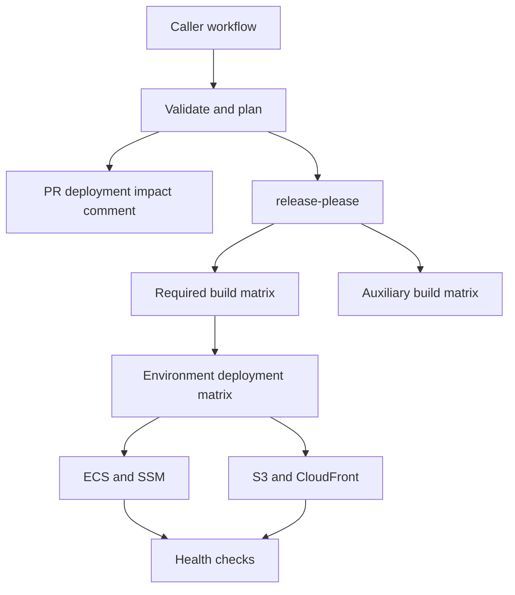

# CanadaLogin release system

This repository centralizes the release pipeline used by CanadaLogin applications. A caller owns two small files:

1. `.github/workflows/release-pipeline.yml`, which selects triggers and calls the versioned reusable workflow.
2. `.github/release-pipeline-configuration.yml`, which declares builds, deployment infrastructure, notifications, and optional hooks.

Release orchestration stays here. Application-specific commands and infrastructure identifiers stay with the application.

## What it provides

- release-please with the existing GitHub App credentials and caller-owned configuration
- `.deployed_versions/<environment>.json` promotion semantics
- environment-specific command builds and Docker builds
- immutable SHA images, optional `latest` and semver image tags
- verified ECR image digests and immutable S3 build prefixes
- S3 build artifacts, S3 deployments, and CloudFront invalidations
- one or many ECS services, stability waits, SSM image parameters, and force redeploy
- DNS audit and SBOM integrations
- auxiliary load-test image builds that do not gate application deployment
- Slack start, success, build failure, and deployment failure notifications
- pull request comments that identify environment and version changes
- repository-owned before-deploy, health-check, after-deploy, and failure hooks
- explicit expected health-check failure assertions for acceptance scenarios
- serialized workflow runs and per-environment deployments

All release decisions and AWS command orchestration are implemented in Python. Workflow shell steps only invoke the Python CLI.

## Quick start

Copy [the caller workflow](examples/caller/release-pipeline.yml) to `.github/workflows/release-pipeline.yml`. Copy the closest application configuration from [examples](examples) to `.github/release-pipeline-configuration.yml`, then update its resource references and commands.

The caller examples pin a reviewed semver release:

```yaml
jobs:
  release:
    uses: cds-snc/canadalogin-release-system/.github/workflows/release.yml@v1.0.6
    secrets: inherit
```

Git tags can technically be moved. Protect release tags and never retarget them; callers requiring GitHub's strongest immutable pin should replace `v1.0.6` with that release's full 40-character commit SHA.

Keep the existing release-please files and `.deployed_versions` directory. The shared workflow reads them from the caller repository.

## How it runs



Every required build must pass before any environment begins deployment. Components for one environment run in one job, and at most one environment job runs at a time. GitHub does not guarantee matrix ordering, so each environment independently reconciles its pinned desired version. This removes the current frontend-build/backend-deploy split-state failure mode and creates a clear boundary for future rollback work.

Only release-please pull requests require the integration acceptance suite. A
write-level repository user can request it by commenting `!test`; the request
starts the manually triggered acceptance workflow, and the release pull request
remains blocked until the `Release pipeline acceptance gate` succeeds.

## Configuration examples

- [Manage application](examples/gc-signin-user-selfservice-webapp/release-pipeline-configuration.yml)
- [Static website](examples/gc-signin-static-website/release-pipeline-configuration.yml)
- [Partner portal](examples/gc-signin-partner-portal/release-pipeline-configuration.yml)
- [Migration application](examples/gc-sign-in-migration/release-pipeline-configuration.yml)
- [Migration RP simulator](examples/gc-signin-migration-oidc-rp-simulator/release-pipeline-configuration.yml)

These are complete mappings of the five release workflows inspected in August 2026.

## Development

The runtime supports Python 3.11 or newer and requires PyYAML.

```sh
python3 -m venv .venv
.venv/bin/python -m pip install -e .
.venv/bin/python -m unittest discover -s tests -v
```

Validate a configuration:

```sh
canadalogin-release validate --config examples/gc-signin-user-selfservice-webapp/release-pipeline-configuration.yml
```

## Documentation

- [Current pipeline inventory](docs/current-pipeline-inventory.md)
- [Architecture and GitHub Actions behavior](docs/architecture.md)
- [Configuration reference](docs/configuration.md)
- [Migration and rollout](docs/migration.md)
- [Atomic deployment and rollback roadmap](docs/rollback-roadmap.md)
- [Validated GitHub Actions experiments](docs/experiments.md)