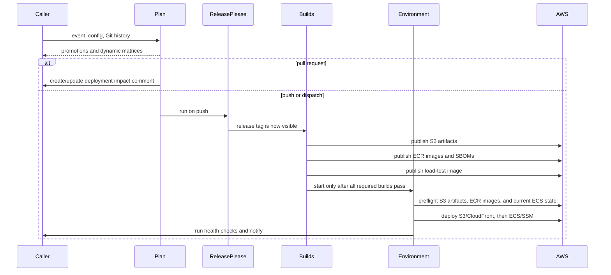

# Architecture

## Decision

Use a reusable workflow as the orchestration boundary and co-versioned composite actions/Python as the implementation boundary.

The public workflow is `.github/workflows/release.yml`. It calls two nested reusable workflows:

- `.github/workflows/build.yml` declares the selected GitHub environment and builds one artifact.
- `.github/workflows/deploy-environment.yml` declares the selected GitHub environment and deploys every component for it.

`actions/setup` installs the Python package from the exact commit containing the running reusable workflow. The Python CLI loads a caller-owned YAML configuration and performs planning, version resolution, builds, AWS operations, hooks, Slack notifications, and pull request comments.

## Why not only a custom action

[`cds-snc/terraform-plan`](https://github.com/cds-snc/terraform-plan) is a good custom-action model for deterministic work inside one existing job. It packages code, inputs, outputs, tests, and generated JavaScript into one step.

A release pipeline must also define job boundaries, matrices, environment approvals, OIDC permissions, concurrency, dependencies, and failure behavior. A composite or JavaScript action cannot create those job-level controls. Using only an action would leave most copied YAML in every caller.

The hybrid keeps Terraform Plan's useful properties, central code and tests, while using reusable workflows for the controls that only workflows can express.

## Why configuration plus hooks

Passing every possible application difference as a reusable-workflow input produces an unstable, very large API. Passing arbitrary inline shell through inputs is also difficult to quote safely.

The release system instead provides tested primitives for current shared behavior:

- command and Docker builds
- S3 artifacts and deployments
- CloudFront invalidation
- ECS service deployment
- SSM current-image parameters
- release and version planning
- notifications and pull request comments

YAML declares those primitives. Hooks are argv arrays executed without a shell from the checked-out caller repository. This provides an escape hatch without copying the shared orchestration.

## GitHub Actions behavior used

The implementation relies on the following current GitHub Actions behavior:

1. A reusable workflow is called at job level with `jobs.<id>.uses`.
2. The `github` context in a called workflow describes the original caller and event.
3. `actions/checkout` in a called workflow checks out the caller repository.
4. `$/path` resolves to the repository and exact commit containing the running workflow or action. It does not resolve to the checked-out caller workspace.
5. A caller in the same organization can use `secrets: inherit`.
6. A called job that sets `environment: <name>` receives that caller repository environment's variables and secrets after protection rules pass.
7. Caller workflow-level `env` values do not propagate to called workflows. Inputs, outputs, repository/environment variables, or explicit secrets must be used.
8. Token permissions can stay the same or become more restrictive through nested workflows; they cannot be elevated. The outer caller must grant every required permission.
9. Matrix jobs can call reusable workflows. Dynamic matrices can come from a prior job's JSON output.
10. Reusable workflows can nest up to ten total levels. This design uses three.
11. `queue: max` allows serialized runs to wait instead of replacing the previously pending run.
12. Re-running one failed job uses the same called-workflow commit as the first attempt. Re-running all jobs resolves a tag again, which is another reason to protect and never move release tags or to pin full commit SHAs.

Relevant GitHub documentation:

- [Reuse workflows](https://docs.github.com/en/actions/sharing-automations/reusing-workflows)
- [Reusing workflow configurations](https://docs.github.com/en/actions/reference/workflows-and-actions/reusing-workflow-configurations)
- [Workflow syntax](https://docs.github.com/en/actions/writing-workflows/workflow-syntax-for-github-actions)
- [Contexts reference](https://docs.github.com/en/actions/reference/workflows-and-actions/contexts)
- [Managing deployment environments](https://docs.github.com/en/actions/how-tos/deploy/configure-and-manage-deployments/manage-environments)
- [Secure use reference](https://docs.github.com/en/actions/security-for-github-actions/security-guides/security-hardening-for-github-actions)

## Execution flow

## Failure boundaries

- A required build failure prevents every deployment.
- Frontend and backend resources for one environment run in one job.
- At most one environment matrix job runs at a time. GitHub does not guarantee matrix order, so environments must be independently reconcilable.
- Build matrices use `fail-fast: false` so all failures are visible before deployment is considered.
- S3 artifacts, desired ECR images, and ECS services/task definitions are checked before the first built-in deployment mutation.
- Every version tag is resolved during planning. A push may resolve the current release manifest to the current SHA while release-please creates that tag later in the same run; manual runs remain strict.
- The reusable release workflow serializes plan, release-please, build, and deployment work per caller repository and pipeline ID; the optional pipeline ID defaults to `default`, while caller workflows retain the same lock as a defense against independent caller jobs.
- SSM is written only after ECS reaches stable state.
- Failure hooks and Slack alerts run in the environment job and therefore name the affected environment.

These controls reduce partial state but do not make the current S3 sync and ECS rolling update atomic. See [the rollback roadmap](rollback-roadmap.md).

## Security model

- External actions are pinned to full commit SHAs.
- The shared code version is coupled to the reusable workflow through `$/` references.
- Untrusted pull request values are passed through environment variables or Python arguments, not interpolated into generated shell source.
- Pull requests use `pull_request`, not privileged `pull_request_target`.
- Configured commands are argv arrays and run with `shell=False`.
- Secrets are passed individually. They are never serialized into JSON, matching GitHub's warning that structured secret blobs can defeat exact-value redaction.
- Mapped build and deployment secrets are removed from Git and AWS child-process environments after their configured values are resolved. Caller-defined build and hook commands do not inherit AWS or GitHub credentials. Hook steps receive only explicitly mapped named secrets in addition to configured variables.
- AWS access uses OIDC and environment-specific role names.
- Jobs receive only the token permissions needed for their role. Ordinary artifact builds use `contents: read`; the isolated SBOM job uses `contents: write` because the pinned SBOM action submits GitHub dependency snapshots.
- Caller rulesets remain responsible for enforcing review requirements before deployment manifests reach main.